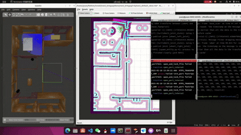

# InitLocation_ROS2

This repository is based on the simulation of bilibili XJU mobile robot. If AMCL is used in navigation, an initial position needs to be given first. With the help of this warehouse, calibration can be carried out after the initial positioning is given to achieve more accurate positioning and correction.

<p align="center">
  
</p>

## Install
```bash
$ colcon build --symlink-install --cmake-args -DCMAKE_BUILD_TYPE=Release
```

## How To Use:
```bash
$ source /opt/ros/humble/setup.bash
$ ros2 run relocation relocation
## Change It To Your Map
$ ros2 service call /map_server/load_map nav2_msgs/srv/LoadMap "{map_url: '/home/yuan/fishbot/src/fishbot_navigation2/maps/map.yaml'}"
## Then give a 2D POSE ESTIMATE
```

## For Simulation
```bash
$ ros2 launch turtlebot3_gazebo turtlebot3_house.launch.py
## Then Use Any Navigation Packages, Change Map, Suah as:
$ ros2 launch fishbot_navigation2 navigation2.launch.py use_sim_time:=True
$ ros2 run relocation relocation
## Change It To Your Map
$ ros2 service call /map_server/load_map nav2_msgs/srv/LoadMap "{map_url: '/home/yuan/fishbot/src/fishbot_navigation2/maps/map.yaml'}"
## Then give a 2D POSE ESTIMATE
```

## Reference link

XJU移动机器人仿真-第3期 建图定位（gmapping、AMCL、rangeRelocation）

https://www.bilibili.com/video/BV1E14y1h7uY?spm_id_from=333.788.videopod.sections&vd_source=b016a52c656ea04afdb827f2a2ebc491
